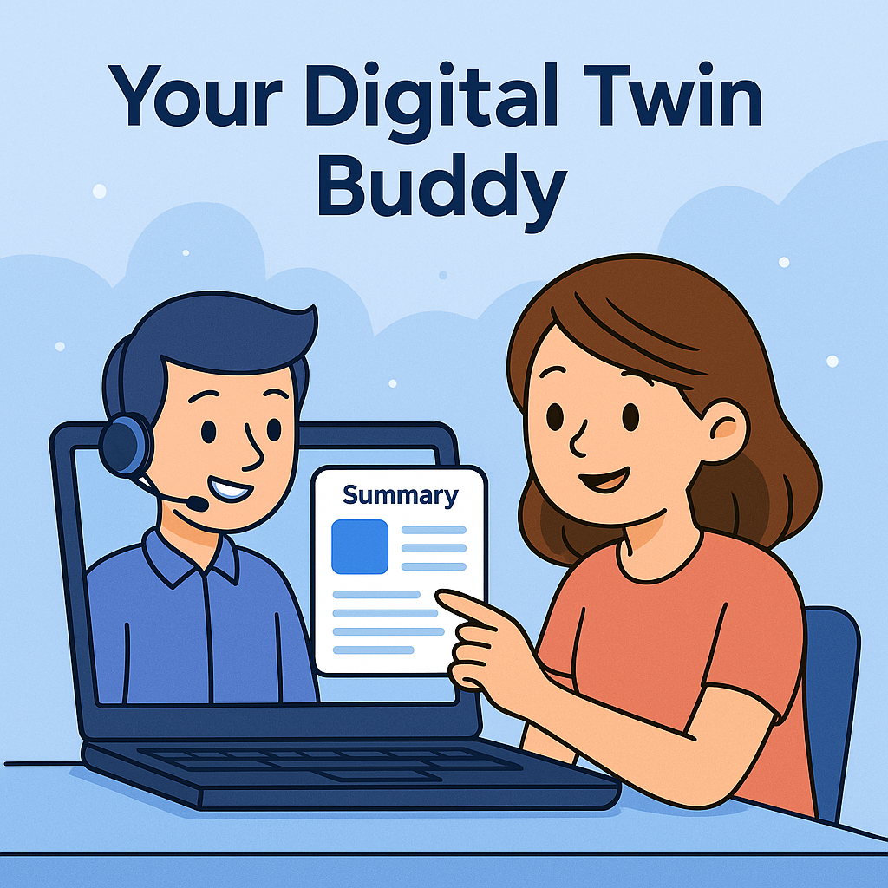

<div id="top"></div> <h1 align="center"> <a href="https://iamdivakarkumar.com/" style="text-decoration: none;" target="_blank">  <br/> Cuata - Computer-Using Agent Team's Assistant </a> </h1> <p align="center"> <b> Your Digital Twin Buddy </b> </p> <br/>

# Introduction

This idea started when I thought about building something that can be your assistant during a Microsoft Teams meeting, especially for those small breaks when you need to step away for a minute. Whether it's someone at the door, or an urgent call, we all have moments where we have to leave the meeting but don’t want to miss anything important. I named it Cuata, which originally stood for Computer Using Agent Team’s Assistant. But later I found out Cuata means “buddy” in Spanish—and it actually fits perfectly with the whole idea.

Cuata is like your digital buddy that steps in for you, watches what’s going on in the meeting, listens to the discussion, looks at the shared screen or slides, and when you come back, gives you a quick summary of what you missed along with screenshots if there were any slides. That way, you're always in the loop.

Over time, this evolved. I figured out I could use the same approach to browse websites, read articles, search for info about people or topics, and even write short summaries directly into Microsoft Word. It’s like having a smart helper that can see, understand, and act like you on your own computer.


# Problem Statement

There are times when you need to step away from your computer during a meeting or while you're doing something important—but you still want to know what happened while you were gone. Most of the time, we end up asking teammates later, or watching long recordings just to catch up. That’s not efficient. I wanted to solve this exact problem: How can I make something that fills in for me, just for those few minutes, and tells me exactly what happened without me missing anything?


# Challenges Involved

I encountered challenges when trying to make the system behave more like a human, especially for handling complex tasks. To address this, I broke down each task into smaller, manageable steps and processed them recursively. This approach helped simplify the process and made it more efficient. Additionally, I implemented a validation step after each action to ensure everything was executed correctly and as expected.

Another major challenge was summarizing long meetings. Turning extensive discussions into concise, meaningful summaries can be time-consuming. To solve this, I leveraged Azure Durable Functions to orchestrate the entire summarization process and Azure Open AI multimodal to understand both the image in the presentation along with transcription text. Once the summary is ready, it sends a notification to the user.

- <b> Human-like Interaction: </b> Simulating user behavior to click, scroll, or type contextually through visual cues on-screen. Everything is built custom as I don't have access to CUA agent models.

- <b> Real-Time Comprehension: </b> Capturing and summarizing live meeting content including shared screens, slides, and spoken words.

- <b> Cross-Context Understanding: </b> Being able to generalize its behavior across websites, articles, documents, and apps.

- <b> Robust Action Validation: </b> Ensuring actions taken (like clicking a button or typing in a field) are contextually correct and verified.

- <b> Orchestrating Multimodal Inputs: </b> Merging screen content, images, and interaction flows in a unified LLM-powered workflow.

# Highlights

🧠 <b> Built a custom Computer Using Agent </b> that can operate your computer just like a human using Semantic Kernel along with different plugins and it is not using <b> CUA agent models </b>

🌐 <b> Microsoft Team's Assistant </b> built to monitor meetings while you're away — providing meeting summaries, slide snapshots, and key discussions you missed.

📝 <b> Browser Assistant </b> Extension to search articles, read webpages, summarize key information, and even document findings into Word files automatically.

👥 <b> "Cuata" - Your Digital Twin Buddy </b> who stays active, listens, thinks, and acts on your behalf when you need it most.

⚙️ <b> Deep Customization Beyond Playwright/Browser Automation </b> While many solutions use Playwright or browser-use MCP libraries for automation, Cuata offers full low-level control over screen elements, enabling deeper customization for highly specific and dynamic use cases

# Architecture


This is how Cuata works under the hood. Everything is built to act like a digital version of you—watching your screen, listening to the meeting, clicking around, typing when needed, and most importantly, knowing what’s going on and reporting it back to you clearly.

<b style="color:orange">

```quote
Disclaimer: Don't misuse this technology. It's meant to help when you left your computer for a minute, not to replace you entirely. Always be ethical and responsible with AI.
```

</b>

At the center of everything sits Semantic Kernel, which acts as Cuata's brain to coordinate all the actions. It plans what to do next, picks the right plugin, asks for confirmations, and even fixes mistakes by re-evaluating decisions. It was chosen because it offers a flexible and modular way to build a real "thinking" assistant, not just a script that clicks blindly.

To actually perform actions like moving the mouse, typing, clicking links, validating screen content, or taking screenshots, Cuata uses a set of plugins like Mouse, Keyboard, Chrome, Locate, and Screenshot Plugins.

🖱️ Mouse, Keyboard, Screenshot, and Locate Plugins allow Cuata to perform any action a typical human would do on the system.

📸 Screenshot Plugin Validation helps double-check if the right action was performed after each click or typing operation.


# High level components

🎥 <b> OpenCV: </b> To check if the user is still present in front of the system during a meeting, OpenCV is used. It simply detects the presence of a face using a lightweight model. This way, Cuata knows whether to stay passive or actively listen and summarize when the user steps away. OpenCV was chosen because it’s fast, doesn't demand heavy GPU power, and works well for simple face detection tasks.

🔍 <b> Azure OCR: </b> Mainly used to locate text elements on the screen. It detects text positions, captures their coordinates, and helps Cuata move the mouse to the right spots to click or interact just like a human would. Instead of understanding meaning, it acts more like the "eyes" that help navigate the desktop reliably.

🛠️ <b> Semantic Kernel: </b> acts as the brain, coordinating all plugins and decision-making through a Think → Select Strategy → Execute loop.

🗣️ <b> Azure OpenAI: </b> Cuata uses Azure OpenAI to handle all the natural language processing needs. Whether it’s summarizing what happened during a meeting, verifying if an action on the screen was done correctly, or planning the next steps, OpenAI provides a reliable brain for the system.

📂 <b> Azure Durable Functions: </b> manage long-running operations like summarizing meetings, consolidating data, and sending notifications.

🛢️ <b> Azure Cosmos DB: </b> stores all the data, including meeting summaries, user preferences, and any other information Cuata needs to function smoothly.

📂 <b> Azure Blob Storage: </b> used to store all the screenshots taken during meetings, so you can refer back to them later.
 
📨 <b> Azure Service Bus: </b> used to send messages between different components of the system, ensuring everything works together seamlessly.


# Teams Agent Workflow:


Teams Agent flow shows how Cuata acts like a personal assistant that attends your meetings, summarizes them, and keeps you informed.

- At the core, we have the Computer Using Agent, which acts like a mini human assistant operating the computer. It uses different plugins like:
    - Mouse Plugin
    - Keyboard Plugin
    - Chrome Plugin
    - Screenshot Plugin
    - Locate Plugin 

These let it interact with the system just like a user.

Inside this agent is the OpenCV Processor that does below actions 

- Checks if you're present in front of the system or not.
- It uses OpenCV face detection to figure out if your face is visible on the webcam.
- This helps Cuata know when you’re active during a meeting or if you’ve stepped away.
- That info can then be used to trigger smart decisions like:
  - Sending you a summary when you're back
  - Letting teammates know you’re away
  - Or adjusting what to summarize based on who was present

It’s part of the “Think → Select Strategy → Execute” loop that the agent follows.

# Meetings Handling – Two Main Workflows

There are two possible flows within this workflow:

## When user is not present at the beginning of the meeting

1. Meeting Notifier flow triggers when the meeting is about to start. It sends a notification to the our Cuata agent.
2. Now the agent checks if the user is present in front of the system using OpenCV.
3. If the user is present, it does nothing. If not present, it triggers the Teams agent workflow
4. It opens the calendar, search for the meeting , and joins it.
5. Once joined, it mutes and starts the transcription.
6. It then starts listening to the meeting and takes screenshots at regular intervals.
7. Once the meeting is over or the user is back, it stops the transcription and sends a summary of the meeting to the user.

## When user left in the middle of the meeting

1. Teams agent flow triggers and checks if the meeting is ongoing.
2. If the meeting is ongoing, it checks if the user is present in front of the system using OpenCV.
3. If the user is present, it does nothing. If not present, it triggers the Teams agent workflow
4. It starts listening to the meeting and takes screenshots at regular intervals.
5. Once the meeting is over or the user is back, it stops the transcription and sends a summary of the meeting to the user.


## Browser Agent Workflow


The "Browser Agent tool" is a powerful tool powered by Azure OpenAI and Semantic Kernel, designed to automate tasks and interact with systems intelligently. It operates in a continuous loop, where it processes instructions and breaks them down into manageable tasks for execution. Here's how it works:

- Instruction Processing: The agent begins by analyzing the input instruction and then splits it into smaller, actionable tasks, ensuring each one is clear and achievable.

- Task Execution: The tasks are executed by leveraging the appropriate plugins for each action. This could involve interacting with browsers, taking screenshots, or processing text.

- Plugins Powering the Browser Agent:
Chrome Plugin + Keyboard/Mouse Plugin: These plugins enable the agent to interact with web browsers in the same way a human would. It can simulate actions like typing, clicking, and navigating through different web pages.

- Screenshot Plugin: This plugin allows the agent to capture a screenshot of the current screen, which is then sent to Azure OpenAI for analysis. This helps the agent understand what is displayed and validate if actions (such as clicking a button) have been completed correctly, creating a feedback loop for accurate task completion.

- Locate Plugin: The locate plugin extracts and identifies text elements from the screen. It defines their exact boundaries and coordinates, enabling the agent to know exactly where to click or where to input text, thus improving precision in task execution. It does this effectively with the help of Azure OCR.

- Summarize Plugin: The agent can take screenshots and request Azure OpenAI to summarize the content of the screen. This is particularly useful for reading lengthy articles, reports, or emails and providing concise summaries or key takeaways.

<b> Output Flow: </b>

Once the agent has completed its task, the results are pushed to external systems such as Windows applications, Outlook, or Word. This feature enables the agent to not only browse and collect information but also deliver tangible results by integrating seamlessly with other software and systems, making it a versatile and efficient assistant.

## Prerequisites

1. Google Chrome
2. Visual Studio 2022 or later
3. Azure Vision API Key
4. Azure Speech API Key
5. Azure OpenAI Key
6. Azure AD app registration for Microsoft Graph API to fetch meeting details
7. Azure Cosmos DB account
8. Azure Blob Storage account
9. Azure Service Bus account

```
 Disclaimers: This project is supported only on Windows OS.
```

# Steps to run the project locally

- If you have 2 or more monitors, please make sure to set the primary monitor as the one where you want to run the project.

- Relace the `appsettings.json` in the Cuata, Cuata.MeetingsIngestor and Cuata.OpenCV Project with the values

```json
{
    "Logging": {
        "LogLevel": {
            "Default": "Information",
            "Microsoft.AspNetCore": "Warning"
        }
    },
    "TenantId": "YOUR_TenantId",
    "APPINSIGHTS_INSTRUMENTATIONKEY": "YOUR_APPINSIGHTS_INSTRUMENTATIONKEY",
    "OTEL_EXPORTER_OTLP_ENDPOINT": "http://localhost:4317",
    "OpenAIEndpoint": "YOUR_ENDPOINT",
    "OpenAIChatCompletionDeploymentName": "gpt4",
    "OpenAITextEmbeddingGenerationDeploymentName": "embedding-small",
    "APPLICATIONINSIGHTS_CONNECTION_STRING": "YOUR_APPLICATIONINSIGHTS_CONNECTION_STRING",
    "IsAutomaticTelemetryEnabled": false,
    "ServiceBusConnectionString": "YOUR_ServiceBusConnectionString",
    "ServiceBusQueueName": "meetings",
    "CognitiveServicesVisionEndpoint": "YOUR_CognitiveServicesVisionEndpoint",
    "CognitiveServicesVisionKey": "YOUR_CognitiveServicesVisionKey",
    "CognitiveServicesSpeechEndpoint": "YOUR_CognitiveServicesSpeechEndpoint",
    "CognitiveServicesSpeechRegion": "eastus",
    "CognitiveServicesSpeechKey": "YOUR_CognitiveServicesSpeechKey",
    "AzureScreenshotFunctionUrl": "http://localhost:7163/api/screenshotSummary",
    "AzureConsolidateSummaryFunctionUrl": "http://localhost:7163/api/consolidateSummary",
    "AzureWebJobsStorage": "YOUR_AzureWebJobsStorage"
}
```

- For the Azure Function, replace the `local.settings.json` with the values

```json
    {
        "IsEncrypted": false,
        "Values": {
            "AzureWebJobsStorage": "UseDevelopmentStorage=true",
            "FUNCTIONS_WORKER_RUNTIME": "dotnet-isolated",
            "CosmosDbConnectionString": "YOURCosmosDbConnectionString",
            "CosmosDbDatabaseName": "Cuata",
            "CosmosDbContainerName": "Meetings",
            "CosmosDbMeetingSummaryContainerName": "MeetingSummary",
            "ServiceBusConnectionString": "YOURServiceBusConnectionString",
            "ServiceBusQueueName": "meetings",
            "ClientId": "YOURClientId",
            "ClientSecret": "YOURClientSecret",
            "TenantId": "YOURTenantId",
            "OpenAIEndpoint": "YOUROPENAIENDPOINT"
            "OpenAIChatCompletionDeploymentName": "gpt4",
            "OpenAITextEmbeddingGenerationDeploymentName": "embedding-small"
        }
    }
```

# Sponsor

Leave a ⭐ if you like this project

<a href="https://www.buymeacoffee.com/divakarkumar" target="_blank"></a>

&copy; [Divakar Kumar](//github.com/Divakar-Kumar)

# Contact

[Website](//iamdivakarkumar.com) | [LinkedIn](https://www.linkedin.com/in/divakar-kumar/)
